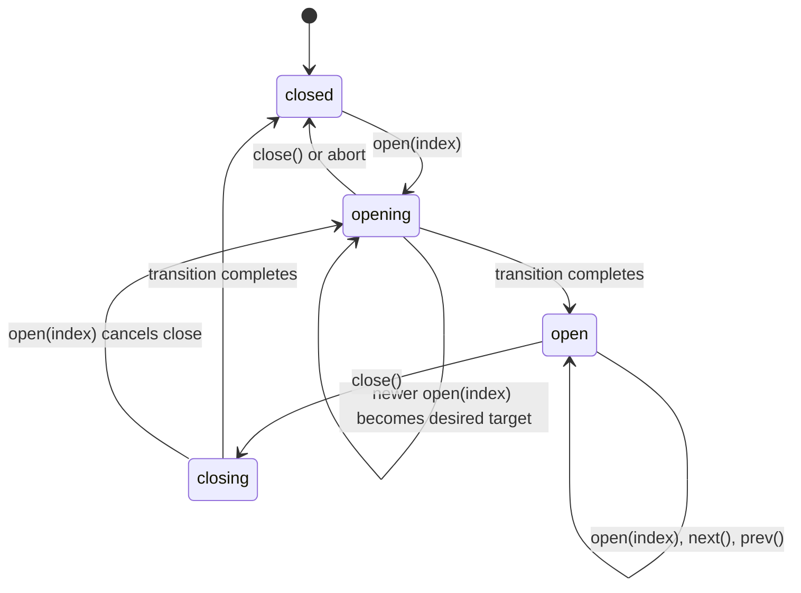

# Nuxt Photo vNext

Status: proposed greenfield refactor  
Baseline: `v0.1.2` / `f29a5fb`  
Last verified: 2026-07-10

## 1. Purpose

vNext is a hard-cutover redesign of Nuxt Photo before its public API is treated
as stable. The goal is not to preserve every 0.1.x convenience. The goal is to
arrive at the smallest coherent library that:

- has one source of truth for every important concept;
- is safe to extend without adding more lifecycle flags or registration modes;
- fails predictably at public boundaries;
- keeps framework-free logic independent from Vue and Nuxt;
- preserves SSR, accessibility, transitions, gestures, and image-adapter
  behavior;
- is understandable by a contributor who did not build the original runtime.

This repository is treated as greenfield. There will be no deprecated aliases,
dual APIs, migration shims, feature flags, or old/new implementations living
side by side. Once a vNext path passes its acceptance tests, the old path is
deleted in the same change.

## 2. Executive decision

Keep the existing bones:

- two public packages: `@nuxt-photo/vue` and `@nuxt-photo/nuxt`;
- a Vue-free `core/` layer guarded by architecture tests;
- recipe components composed from public primitives;
- the function-shaped `ImageAdapter` boundary;
- rows, columns, and masonry as pure layout algorithms;
- the built-in accessible lightbox recipe and lower-level primitives;
- structure/theme CSS separation;
- explicit bundle-size, SSR, hydration, packaging, and browser gates.

Hard-cut the accidental complexity:

- rendering components no longer transform arbitrary CMS records;
- `PhotoGroup` no longer has auto and explicit modes;
- photo IDs are strings, not `string | number`;
- `meta` is application-owned and never controls library behavior;
- album layout options have one configuration path;
- public controller state is readonly;
- invalid-target controller calls fail instead of silently resolving;
- lifecycle intent and lifecycle state have one owner;
- transition work is cancellable and reconciled through one runner;
- gesture ownership is represented by one discriminated session;
- Embla types, plugins, prerelease details, and private engine state are removed
  from the public API;
- duplicated runtime helpers and empty placeholder folders are deleted;
- Nuxt's app facade becomes the Vue facade rather than a second curated API.

The expected result is a smaller public surface and substantially less runtime
branching, even though the refactor itself is large.

## 3. Evidence and corrections

This plan combines two independent reviews, then checks their claims against the
current source, tests, build output, and relevant git history. The following are
facts, not design preferences.

Baseline verification completed before this document: `pnpm lint`, the package
build/typecheck, and all 224 unit/integration tests passed. Browser e2e was not
rerun for the document-only change.

### 3.1 Verified strengths

| Claim                                                             | Evidence                                                                                                    | Decision                                                                                                                           |
| ----------------------------------------------------------------- | ----------------------------------------------------------------------------------------------------------- | ---------------------------------------------------------------------------------------------------------------------------------- |
| `core/` is independent from Vue and Nuxt.                         | `packages/vue/test/architecture.test.ts` checks the import graph; current core source has no Vue import.    | Preserve and strengthen the test.                                                                                                  |
| Recipes genuinely compose public primitives.                      | `packages/vue/src/components/Lightbox.vue` imports its building blocks from `primitives/index.ts`.          | Preserve the recipe/primitive split.                                                                                               |
| `ImageAdapter` is a narrow, useful seam.                          | `packages/vue/src/core/types.ts`; Nuxt injects it through `ImageAdapterKey`.                                | Keep the function contract.                                                                                                        |
| Race guards were added for observed behavior.                     | Commit `4e07d39` added close-during-open cancellation and queued-open invalidation with regression tests.   | Do not replace the guards with an unproven single counter. Preserve the tests as behavioral specifications.                        |
| Disabled PhotoGroup behavior is intentional.                      | Commit `71e6525`, current tests, and `docs/.../sharp-edges.md` define an initially disabled group as inert. | vNext must choose one uniform lifecycle contract rather than calling the existing gate redundant.                                  |
| Nuxt runtime component/style paths work in the current workspace. | Module integration and path-existence tests pass.                                                           | Do not claim the relative path is broken. Add a packed-install test before changing it.                                            |
| The source `app.d.ts` currently serves a build-tool need.         | A clean diagnostic build without it succeeded but emitted a zero-byte `dist/runtime/app.d.ts`.              | Do not add code generation merely to remove the file. Reduce both mirrors to the same one-line facade and keep the equality guard. |

### 3.2 Verified problems

| Problem                                                                | Current evidence                                                                                                                                           | Consequence                                                                                                                                 |
| ---------------------------------------------------------------------- | ---------------------------------------------------------------------------------------------------------------------------------------------------------- | ------------------------------------------------------------------------------------------------------------------------------------------- |
| Provider existence can disagree with reactive-looking component state. | `Photo.vue` creates `soloCtx` from the initial `isSolo.value`; `useAlbumLightbox.ts` computes `hasOwnLightbox` once while other decisions remain computed. | A later prop/mode change can expose interactive behavior without the context needed to execute it.                                          |
| Auto PhotoGroup bypasses canonical aggregate validation.               | Explicit `photos` go through `resolveRecipePhotos`; registered children are returned directly from `registrationMap`.                                      | Duplicate IDs across children only warn in development and remain in the lightbox collection. The group's validation policy does not apply. |
| Unknown photo inputs are cast before validation.                       | `normalizePhotos` casts the mapped array to `PhotoItem[]` before reading fields.                                                                           | `null` and `undefined` produce generic `TypeError`s instead of structured validation issues.                                                |
| `meta` is not actually application-only.                               | `computeZoomLevels` reads `meta.minZoom` and `meta.maxZoom` through casts.                                                                                 | A documented free-form bag silently changes viewer behavior; non-finite values can create invalid zoom state.                               |
| Public controller state is writable.                                   | `LightboxController.activeIndex` is a mutable `Ref<number>`.                                                                                               | A consumer can bypass carousel navigation and desynchronize the runtime.                                                                    |
| Album layout has two sources.                                          | `layout` object options are merged with top-level `targetRowHeight` and `columns`.                                                                         | Precedence logic and documentation must cover equivalent ways to express the same behavior.                                                 |
| Recipe trigger behavior is duplicated.                                 | `Photo.vue`, `PhotoGroup.vue`, and `useAlbumLightbox.ts` independently build click/keyboard/ARIA bindings.                                                 | Keyboard and label semantics have already drifted.                                                                                          |
| Gesture state has shadow encodings.                                    | `GestureMode` already includes `pinch`, but `emblaStolen`, nullable sessions, active-pointer count, and captured-pointer state overlap it.                 | Invalid combinations are representable and reset behavior is difficult to audit.                                                            |
| Runtime helpers are duplicated.                                        | `devWarn` exists three times, `round` twice, and the debug implementation twice.                                                                           | Behavior and environment detection can drift; contributors cannot identify the canonical helper.                                            |
| Carousel API and correctness are vendor-shaped.                        | Public props expose Embla option/plugin types; `snapState.ts` reads `internalEngine()`, and all Embla packages are `9.0.0-rc02`.                           | Vendor upgrades are public API changes and may subtly desynchronize dots, thumbs, counters, and lightbox activation.                        |
| Nuxt option object guards accept arrays.                               | The guards test `typeof value === 'object'` without rejecting arrays.                                                                                      | Invalid runtime configuration can pass a boundary that claims to fail fast.                                                                 |

### 3.3 Claims deliberately not adopted

These points from the reviews are either incorrect, insufficiently proven, or a
worse tradeoff than the current design.

1. **“Add `pinch` to `GestureMode`.”** It already exists. The defect is that the
   enum is not the sole session owner.
2. **“Replace all race guards with one epoch.”** An epoch detects stale work but
   does not serialize quick opens, abort an in-flight decode, or guarantee that
   the latest queued request runs. vNext uses one cancellable reconciler and
   re-earns every interleaving test.
3. **“`lightboxEnabled` is `X && X`.”** The first value is an initial capability;
   the second is current prop state. The current behavior is asymmetric, not
   redundant.
4. **“Generate `app.d.ts`.”** The current builder does not generate a usable
   declaration from the re-export-only runtime file. A new generator would be
   more machinery than a one-line mirrored facade.
5. **“Export a component manifest from the Vue package.”** That would create a
   new public subpath to remove a small Nuxt-owned list. Auto-registration is a
   Nuxt concern; the list stays local and is contract-tested.
6. **“Make open and close transition planning symmetrical.”** Similar-looking
   code does not require identical abstractions. `CloseTransitionPlan.reason`
   currently earns its keep in pure decision tests and debugging.
7. **“Brand validated photos.”** A branded public photo type would tax every
   caller. Runtime validation should become honest without changing structural
   TypeScript into a nominal model.
8. **“Generalize to image/video/custom media now.”** There is no concrete
   requirement. `resolveSlide` remains the escape hatch; a media union would add
   concepts rather than delete them.

## 4. vNext design principles

1. **Transform before the UI boundary.** Components render `PhotoItem`; they do
   not own CMS normalization.
2. **One concept, one owner.** A state may be derived in many places but written
   in one place.
3. **Intent and actual state are different concepts.** They may coexist; two
   writable representations of actual state may not.
4. **Static capability is explicit.** If a provider can only be created during
   setup, every dependent behavior uses the same setup-time decision.
5. **Invalid inputs fail at the nearest public boundary.** Internal math keeps
   defensive assertions but does not invent a second policy.
6. **Hot-path mutability stays private.** Pointer/RAF performance may use plain
   mutable objects, but consumers receive readonly or operation-based APIs.
7. **Vendor types stop at the integration boundary.** Public API changes are
   product decisions, not dependency upgrades.
8. **Advanced composition uses primitives.** Recipe components do not grow a
   second mode to reproduce primitive functionality.
9. **No speculative extension system.** New adapters, registries, manifests,
   state machines, or options require a current acceptance criterion.
10. **A hard cutover deletes the replaced path.** Passing tests is not permission
    to retain old code “for safety.”

## 5. Target public API

### 5.1 Canonical photo model

```ts
export interface PhotoItem<
  TMeta extends Readonly<Record<string, unknown>> = Readonly<
    Record<string, unknown>
  >,
> {
  readonly id: string
  readonly src: string
  readonly width: number
  readonly height: number
  readonly thumbSrc?: string
  readonly alt?: string
  readonly caption?: string
  readonly description?: string
  readonly srcset?: string
  readonly meta?: TMeta
}
```

Decisions:

- `id` is a non-empty string. Database numbers are converted before they reach
  the library. This deletes string/number comparison ambiguity and the public
  `photoId()` normalization helper.
- Dimensions must be finite and greater than zero.
- `meta` is carried through but never interpreted by core, recipes, adapters, or
  the viewer.
- Per-photo zoom overrides are deleted. If a real requirement appears later, it
  gets an explicit typed field and boundary validation.
- Fields are readonly. Updating a photo means replacing it in the source array,
  which makes Vue reactivity and active-ID tracking predictable.
- `PhotoMapper` and every `itemMapper` prop are deleted. Applications use an
  ordinary `computed`/`map` at their data boundary.

Before:

```vue
<PhotoAlbum :photos="cmsAssets" :item-mapper="fromCms" />
```

After:

```ts
const photos = computed<PhotoItem[]>(() =>
  cmsAssets.value.map((asset) => ({
    id: String(asset.id),
    src: asset.url,
    width: asset.width,
    height: asset.height,
    alt: asset.alt ?? undefined,
  })),
)
```

```vue
<PhotoAlbum :photos="photos" />
```

The application already owns the CMS type, error semantics, and refresh policy.
Keeping that transformation outside a rendering component improves both sides.

### 5.2 Validation contract

```ts
export type InvalidPhotoPolicy = 'throw' | 'drop'

export interface InvalidPhotosEvent {
  readonly owner: string
  readonly issues: readonly PhotoValidationIssue[]
  readonly rawPhotos: readonly unknown[]
}

export class PhotoValidationError extends Error {
  readonly owner: string
  readonly issues: readonly PhotoValidationIssue[]
}
```

Rules:

- Default policy is `throw` in every environment.
- `drop` has identical data behavior in development and production.
- `onInvalidPhotos` runs for `drop`; the thrown error contains the same issues
  for `throw`.
- The `warn` policy is deleted because it combines a reporting choice with an
  implicit drop policy and changes observability by environment.
- `null`, `undefined`, arrays, primitives, missing fields, non-finite dimensions,
  empty IDs/sources, and duplicate IDs all become structured issues.
- For a duplicate ID, every colliding entry is invalid; the library never picks
  an arbitrary winner.
- Every collection entering a recipe is validated. PhotoGroup's aggregate child
  registry always throws on duplicate IDs; silently dropping a registered child
  would leave rendered interactive markup with no matching slide.
- Layout functions keep a small invariant assertion because they are internal
  pure functions. They do not accept a validation policy.

### 5.3 Lightbox controller

```ts
export interface LightboxController {
  readonly photos: ComputedRef<readonly PhotoItem[]>
  readonly count: ComputedRef<number>
  readonly activeIndex: ComputedRef<number>
  readonly activePhoto: ComputedRef<PhotoItem | null>
  readonly isOpen: ComputedRef<boolean>

  open(index?: number): Promise<void>
  openById(id: string): Promise<void>
  close(): Promise<void>
  next(): void
  prev(): void
  toggleZoom(): void
}

export interface LightboxProviderController extends LightboxController {
  readonly hiddenThumbnailIndex: Readonly<Ref<number | null>>
  setThumbnailRef(
    index: number,
  ): (element: Element | ComponentPublicInstance | null) => void
}
```

Decisions:

- `activeIndex` and all read models are readonly.
- `openPhoto(photo)` is deleted. Stable string IDs and index-based opening cover
  the real use cases without object-identity ambiguity.
- `open()` and `openById()` reject with a namespaced `RangeError` when the target
  does not exist. They do not warn-and-resolve in development or silently no-op
  in production.
- `close()` is idempotent. Concurrent callers receive completion of the same
  close intent.
- `next()` and `prev()` do nothing while closed and wrap only when the viewer's
  loop behavior says they should.
- Provider-only transition anchors are an explicit extended interface rather
  than an undocumented inferred return shape.
- `LightboxSlideRenderer` returns `VNodeChild`, not `unknown`.

### 5.4 Component contracts

#### `Photo`

- accepts one `PhotoItem`;
- standalone lightbox remains opt-in (`lightbox` default `false`);
- receives `transition` for parity with other recipes;
- inside PhotoGroup, the group owns lightbox behavior;
- `lightboxIgnore` opts out of group registration;
- its setup-time lightbox capability is the sole source for context creation,
  interactivity, and rendering.

#### `PhotoAlbum`

```ts
type AlbumLayout =
  | { type: 'rows'; targetRowHeight?: ResponsiveParameter<number> }
  | { type: 'columns'; columns?: ResponsiveParameter<number> }
  | { type: 'masonry'; columns?: ResponsiveParameter<number> }
```

- accepts `readonly PhotoItem[]`;
- retains string shorthands (`"rows"`, `"columns"`, `"masonry"`) for defaults;
- configurable values exist only inside the object-form `layout`;
- top-level `targetRowHeight` and `columns` are deleted;
- defaults to its own lightbox when it is not inside PhotoGroup;
- delegates to PhotoGroup when nested;
- validates its own list before layout math.

#### `PhotoGroup`

PhotoGroup has one job: collect descendant `Photo` and `PhotoAlbum` entries into
one shared lightbox.

- The `photos`, `itemMapper`, and explicit/custom-layout mode are deleted.
- The `groupMode` branch and “explicit list wins” warning are deleted.
- A shallow-reactive registration Map replaces `registrationVersion` and the
  manual `void registrationVersion.value` dependency.
- The aggregate list is validated, and duplicate IDs across children throw.
  PhotoGroup has no drop policy because it does not own the child markup it
  would need to disable or remove.
- The default scoped slot may expose `{ photos, controller }`, but it does not
  manufacture generic `trigger()` attribute bags for arbitrary markup.
- Template-ref methods expose `open`, `openById`, and `close`; all use the same
  controller implementation.

Custom layouts move to the primitives that already model explicit collections:

```vue
<LightboxProvider :photos="photos">
  <div class="hex-grid">
    <PhotoTrigger
      v-for="(photo, index) in photos"
      :key="photo.id"
      :photo="photo"
      :index="index"
      v-slot="{ hidden }"
    >
      
    </PhotoTrigger>
  </div>

  <Lightbox />
</LightboxProvider>
```

This is intentionally a little more explicit. Custom layout is the advanced
layer; it should compose the provider, triggers, and recipe rather than forcing
PhotoGroup to contain a second provider API.

#### `PhotoCarousel`

PhotoCarousel keeps its product features but stops exposing Embla as its API.

```ts
export interface PhotoCarouselOptions {
  readonly loop?: boolean
  readonly dragFree?: boolean
  readonly slidesToScroll?: number
}

export interface PhotoCarouselAutoplayOptions {
  readonly delayMs?: number
  readonly stopOnInteraction?: boolean
  readonly stopOnMouseEnter?: boolean
}
```

- `options` uses the library-owned type above;
- `plugins` and `thumbsOptions` are deleted;
- `autoplay` is `boolean | PhotoCarouselAutoplayOptions`;
- alignment, containment, thumb dragging, and animation duration are internal
  product decisions until a concrete requirement proves another option;
- slots remain library-owned and contain no Embla types;
- lightbox remains opt-in because a carousel is already an interactive viewer;
- `CarouselLayoutHost` is deleted once PhotoCarousel owns its static provider
  capability directly.

### 5.5 Static lightbox capability

vNext deliberately does not pretend that provider creation is freely reactive.

- `lightbox`, `transition`, `imageAdapter`, and provider-level `minZoom` are
  setup-time options for recipe/provider instances.
- Changing them after mount is unsupported and emits one development warning.
- `photos` remains reactive.
- Consumers that need a different capability remount the component with a new
  `key`.
- The initial capability is used consistently for provider creation, trigger
  semantics, rendered lightbox, and exposed controller behavior. There is no
  one-way “can disable but cannot enable” state.

This is simpler and more honest than half-supporting reactive provider creation.
If dynamic enabling becomes a real product requirement, it must be implemented
as a structural provider-host remount with explicit state-reset semantics.

### 5.6 Responsive parameters

Keep the current static-or-resolver model and symbol metadata. Add boundary
validation:

- `responsive({})` throws;
- keys must be finite and greater than or equal to zero;
- container widths passed to public resolvers must be finite;
- breakpoint metadata has one canonical sorted representation;
- `mergeResponsiveBreakpoints` contains no explicit `any`.

Do not replace this small helper with a breakpoint service or configuration
object.

## 6. Target architecture

```text
packages/vue/src/
  index.ts                         public Vue facade
  styles.css

  core/                            framework-free, deterministic logic
    types.ts                       PhotoItem, adapters, layouts, transitions
    env.ts                         single isDev/devWarn implementation
    debug/logger.ts                single debug contract + implementation
    geometry/
    image/
    layout/
    photo/normalize.ts             canonical runtime photo boundary
    transition/
    viewer/
    utils/math.ts                  single round implementation

  composables/                     public composable entry points only
    index.ts
    useContainerWidth.ts
    useLightbox.ts
    useLightboxProvider.ts

  lightbox/                        internal runtime owned by the lightbox domain
    controller.ts
    runtime.ts
    lifecycle.ts                   intent reconciler and cancellable operation
    carousel.ts                    viewer carousel, not PhotoCarousel recipe
    panzoom.ts
    input/
      pointer.ts
      keyboardWheel.ts
      velocity.ts
    transitions/
      state.ts
      open.ts
      close.ts
      animation.ts
    watchers.ts

  components/                      public recipes and feature-private helpers
    Lightbox.vue
    Photo.vue
    PhotoAlbum.vue
    PhotoCarousel.vue
    PhotoGroup.vue
    shared/
      photoTriggerBindings.ts
      resolveLightboxComponent.ts
    photo-album/
      AlbumThumbnail.vue
      layoutState.ts
      styles.ts
      lightbox.ts
    photo-carousel/
      CarouselLayout.vue
    photo-group/
      context.ts

  primitives/                      public low-level Vue building blocks
  provide/keys.ts                  public injection keys and public contracts
  types/slots.ts                   public slot contracts
  integrations/embla/              vendor implementation, no public types
  internal/
    bodyScroll.ts
    requireInjection.ts
```

Moves are justified only when they clarify ownership:

- `composables/` stops being a catch-all for internal runtime modules;
- album-only logic moves next to PhotoAlbum;
- group context moves next to PhotoGroup instead of occupying a generic
  top-level `context/` category;
- animation, input, and transition code live under the lightbox domain;
- `utils/` is deleted because its current contents already have canonical homes;
- empty `core/collection`, `core/dom`, and `core/physics` directories are deleted;
- `lightboxRuntimeTypes.ts` is deleted and its one type moves to its owner.

Do not split files merely to hit a line count. As a review trigger, production
files above roughly 450 lines and test files above roughly 600 lines require a
cohesion justification. No handwritten file may approach 1,000 lines.

## 7. Lightbox lifecycle redesign

### 7.1 Current invariant to preserve

The current tests prove behavior that vNext must retain:

- close during a pending open/decode returns promptly and leaves the viewer
  closed;
- a queued open does not execute after a close invalidates it;
- quick open requests land on the last requested slide;
- a failed image load does not leak into the next active slide;
- keydown and body-scroll ownership attach once and release on close/unmount;
- photo reorder preserves the active ID;
- removing the active photo closes the viewer;
- two providers do not release each other's scroll lock.

The current `openToken`, `closeGeneration`, `pendingOpen`, and
`skipActiveIndexWatch` were added around these requirements. They may be deleted
only when one replacement model passes the same tests.

### 7.2 Canonical model

There are two legitimate concepts:

1. **Desired state:** the latest external intent (`closed` or `open(index)`).
2. **Actual lifecycle:** `closed`, `opening`, `open`, or `closing`.

There is one runner that reconciles actual lifecycle toward desired state.
There are not multiple independently writable representations of “mounted” or
“animating.”

```ts
type LightboxIntent = { kind: 'closed' } | { kind: 'open'; index: number }

type LightboxStatus = 'closed' | 'opening' | 'open' | 'closing'

type ActiveRun = {
  readonly signal: AbortSignal
  readonly done: Promise<void>
}
```

The exact implementation may differ, but it must satisfy these ownership rules:

- `status` is the only writable actual lifecycle state;
- DOM mount is derived as `status !== 'closed'`;
- transition/controls disabled state is derived from `status` and the active
  visual operation;
- one active run owns its `AbortController` and completion promise;
- `open()`/`close()` update desired intent and await reconciliation;
- close aborts an opening run immediately;
- a new open updates the desired index; the runner, not another caller, decides
  whether to retarget or start the next operation;
- every animation and image-load continuation checks or observes cancellation;
- unmount aborts the run, RAF work, timers, pointer captures, keydown, and scroll
  ownership.



An epoch may exist inside the runner as an implementation detail, but an epoch
alone is not the architecture.

### 7.3 Side-effect ownership

- Lifecycle owns global keydown attachment and scroll locking.
- `LightboxRoot` owns focus trapping, page isolation, and focus restoration.
- Panzoom owns its RAF and transform mutations.
- Pointer input owns pointer capture and tap timers.
- Transition functions own visual interpolation but not lifecycle mount state.
- Image loading owns its cache and timeout; lifecycle decides what a result means
  for the current run.

Active-index side effects must have one path. The current pattern of suppressing
a watcher during open because transition callbacks perform equivalent work is
deleted. Acceptable implementations include a single status-aware index effect
or a single `activateIndex(index, reason)` operation. There may not be both a
watcher path and a transition path that need a suppression flag.

### 7.4 Error behavior

If a custom adapter, geometry read, renderer, or animation throws:

- the operation rejects with the original cause;
- status settles to a documented valid state;
- keydown/scroll/focus ownership is not leaked;
- no stale continuation can reopen or mutate the viewer;
- debug logging may add context but must not replace error propagation.

The current open path's possibility of leaving `lifecycleStatus` as `opening`
after a rethrown transition error is covered by a new runtime-level test before
the refactor begins.

## 8. Gesture and panzoom redesign

### 8.1 Keep the performance model

The mutable RAF motion object is justified. Vue refs should not be allocated or
replaced for every pointer/animation frame. What changes is ownership:

- the motion object becomes private to panzoom;
- gesture handlers call panzoom operations rather than receiving and mutating
  `panzoomMotion` directly;
- reactive values are named according to what they represent (`targetScale`,
  `settledScale`, or actual displayed scale); they do not silently present a
  destination as a live value;
- panzoom cancels RAF work on unmount.

### 8.2 One gesture session

`GestureMode` already contains `pinch`. vNext represents the active interaction
with one discriminated session rather than an enum plus shadow booleans.

```ts
type GestureSession =
  | { kind: 'idle' }
  | { kind: 'tap'; pointerId: number /* start data */ }
  | { kind: 'slide'; pointerId: number /* start data */ }
  | { kind: 'pan'; pointerId: number /* start data */ }
  | { kind: 'close'; pointerId: number /* start data */ }
  | { kind: 'pinch'; pointerIds: readonly [number, number] /* start data */ }
```

Raw `activePointers` and `capturedPointers` may remain because they represent
browser resources, not domain phase. However:

- `emblaStolen` is deleted and derived from the session kind;
- session reset is total and releases all owned captures;
- transition from one pointer to pinch happens in one function;
- pointer cancel and unmount share the same cleanup operation;
- keyboard/wheel handling is separated from pointer-session code;
- core gesture classification remains pure and tested.

Target outcome: the input facade depends on a small panzoom controller and a
small navigation controller, not a 30-field configuration object.

## 9. Transition design

Keep explicit open and close choreography. They have different user-facing
behavior and do not need a generic transition framework.

Required changes:

- animation helpers accept `AbortSignal` and stop scheduling frames after abort;
- fixed waits are cancellable;
- the close watchdog is deleted only if abortable operations make “stuck
  animating” structurally impossible;
- repeated FLIP base-style construction is extracted only where the result is
  truly identical;
- `computeCloseDragRatio` becomes the one canonical implementation and ghost
  state calls it instead of duplicating the formula;
- the long file-header narration in `openTransition.ts` is shortened after the
  lifecycle becomes legible in code;
- `CloseTransitionPlan` remains a pure, typed decision with a reason unless an
  implementation demonstrably deletes more code by changing it.

Do not introduce transition strategy classes, policy registries, or a generic
animation DSL.

## 10. Carousel boundary redesign

### 10.1 Public boundary

No exported declaration from `@nuxt-photo/vue` or `@nuxt-photo/nuxt/app` may
mention an Embla type. Raw plugins and arbitrary vendor options are no longer a
supported customization layer.

The public behavior is defined by Nuxt Photo:

- photo/slide count;
- current selected photo;
- deterministic snap groups from `slidesToScroll`;
- dots, thumbnails, counter, and lightbox activation use the same group model;
- loop and drag-free behavior;
- autoplay behavior represented by library-owned options;
- slot contracts and exposed methods represented by library-owned types.

### 10.2 Integration boundary

- `internalEngine()` is not read anywhere.
- `snapState.ts` and its unsafe fallback are deleted.
- Grouping is computed canonically from the library's constrained options, then
  Embla is configured to implement that model.
- Integration tests compare real Embla selection against the canonical groups.
- The chosen Embla release must be non-prerelease before production, unless a
  written exception explains why no supported release can meet the contract.
- Dependency upgrades do not change public types.

If the constrained contract cannot be implemented without private state, the
correct response is to narrow carousel behavior further or reconsider the
dependency—not to restore a public vendor escape hatch.

## 11. Nuxt package redesign

### 11.1 App facade

`@nuxt-photo/nuxt/app` becomes exactly the public Vue facade:

```ts
export * from '@nuxt-photo/vue'
```

Both `src/runtime/app.ts` and `src/runtime/app.d.ts` contain that one line while
the current builder requires the source declaration. The equality architecture
test remains. The Nuxt export test compares the facade to the Vue root rather
than maintaining a second hardcoded name snapshot.

### 11.2 Module ownership

Keep Nuxt registration lists local. They are not a second public API:

- recipe auto-registration remains a Nuxt-owned explicit array;
- primitive auto-registration remains opt-in and explicit;
- the auto-import list remains the intentionally small Nuxt convenience surface;
- one test asserts every registered component file exists after a build;
- one packed-consumer fixture verifies the same resolution through installed
  tarballs before changing the current relative path strategy.

Do not add `@nuxt-photo/vue/manifest`.

### 11.3 Options

Move option types and validation to `packages/nuxt/src/options.ts`. Keep direct
assertions rather than adding a schema dependency.

Validation must:

- reject arrays where a plain record is expected;
- reject `null` at every object boundary;
- validate nested `thumb`, `slide`, and `lightbox` records;
- use assertion signatures so later code needs no number casts;
- validate before mutating Nuxt options or registering plugins/components;
- keep defaults in one typed constant used by `defineNuxtModule` and tests.

`module.ts` should read as orchestration: validate, resolve provider, install
plugins, register components/imports, and register CSS.

## 12. Utilities, globals, and derived state

### 12.1 Delete duplicate helpers

- `core/env.ts` owns `isDev` and `devWarn`.
- `core/debug/logger.ts` owns debug channels, flags, contract, and logger.
- `core/utils/math.ts` owns `round`.
- `lightbox/transitions/animation.ts` owns `wait`, `nextFrame`, easing, and
  cancellable numeric animation.
- `lightbox/input/velocity.ts` owns `VelocityTracker`.
- `internal/bodyScroll.ts` owns the reference-counted body lock.

Delete `utils/runtime.ts` and the duplicated portions of `internal/runtime.ts`.

### 12.2 Global debug state

The current provider assignment to `window.__NUXT_PHOTO_DEBUG__` is unsafe when
multiple providers exist because the last provider replaces the global flags.
vNext uses one internal module-level flag object per loaded library instance.
The development global points to that object once; every provider logger reads
the same flags. Do not add a second injection key or per-provider debug state.

### 12.3 Derived state

- Body-scroll lock count is canonical module state with ownership tests.
- Image-load cache remains derived and bounded; failures are not cached.
- PhotoGroup's photo list is derived from its reactive registry and validated on
  read.
- Breakpoint metadata is derived from responsive resolvers.
- No derived value gets a second manual invalidation counter when Vue can track
  the canonical collection directly.

## 13. Comment style

Keep comments that explain:

- browser quirks, such as pointer-capture exceptions;
- why a threshold exists;
- why an unstable vendor boundary is constrained;
- ordering or cancellation invariants that are not expressible in types;
- performance ownership, especially raw mutable RAF state.

Delete or rewrite comments that:

- narrate the next line;
- duplicate an entire function's control flow;
- explain a synchronization flag that the new ownership model deletes;
- claim an internal barrel is publicly re-exported when it is not;
- promise behavior contradicted by code.

Public components, composables, types, errors, and mount-time option semantics
receive JSDoc. Internal functions receive comments only for non-obvious reasons
or invariants.

## 14. Test architecture

### 14.1 Characterization tests added before refactoring

Add focused tests for currently missing or fragile behavior:

1. `null`, `undefined`, arrays, and primitives in every photo policy;
2. duplicate IDs across separate Photo/PhotoAlbum children in PhotoGroup;
3. adapter or renderer exceptions during open and close;
4. initial static provider capability and dev warnings on option changes;
5. unmount during panzoom RAF, open animation, close animation, and pinch;
6. invalid `open(index)` and `openById(id)` errors;
7. responsive negative/non-finite keys;
8. array-shaped Nuxt options;
9. real packed Nuxt and Vue tarballs installed in a temporary consumer;
10. public type checks proving readonly controller state and removed props.

These tests are the gate for deleting old mechanisms. They are not a request to
preserve undocumented accidental behavior.

### 14.2 Reorganization

Split `recipeContracts.test.ts` by behavior:

```text
packages/vue/test/recipes/
  photo.test.ts
  album.test.ts
  group-registration.test.ts
  lightbox-capability.test.ts
  custom-slides.test.ts
  validation.test.ts
  focus.test.ts
```

Create only a small `test/support/` layer:

- `mount.ts`;
- `flush.ts`;
- browser observer/image stubs;
- shared photo fixtures.

Do not build a test framework. Contract tests assert observable DOM/controller
behavior. Registry algorithm details, lifecycle reconciliation, gesture
sessions, and transition planning receive focused unit tests next to their
domain suites.

### 14.3 Gates

Every vNext phase ends green on the relevant subset. Before merging the final
cutover, run:

```bash
pnpm lint
pnpm typecheck
pnpm test:unit
pnpm test:module-package
pnpm size
pnpm build:playground
pnpm --filter nuxt-photo-playground-tw build
pnpm build:docs
pnpm test:e2e
pnpm release:pack
```

The packed-consumer smoke test becomes part of `release:pack` or an adjacent
release gate. Bundle-size budgets may change only with an explained product
tradeoff.

## 15. Implementation sequence

Each phase is a hard cutover. Do not merge a phase with both old and new paths.

| Phase                        | Hard cutover                                                                                                                                                                                                                             | Required proof                                                                                             |
| ---------------------------- | ---------------------------------------------------------------------------------------------------------------------------------------------------------------------------------------------------------------------------------------- | ---------------------------------------------------------------------------------------------------------- |
| **0 — characterize**         | Add section 14.1 tests, record bundle sizes, rename race tests as lifecycle specifications, and add target API type fixtures before implementation changes.                                                                              | Intended behavior is explicit; accidental behavior is marked for deletion.                                 |
| **1 — public API**           | Make IDs readonly strings; remove `photoId`, mappers, `warn`, meta zoom, `openPhoto`, writable controller state, duplicate album props, and public Embla types; add standalone Photo transition.                                         | Source, docs, playgrounds, fixtures, and tests compile only against vNext; no deprecated overload remains. |
| **2 — photo/group boundary** | Validate `unknown` honestly; add `PhotoValidationError`; route every list through it; make PhotoGroup auto-only with a shallow-reactive registry; migrate custom layouts to primitives; remove PhotoGroup from carousel provider wiring. | No explicit/auto branch or version counter remains; custom layout, nesting, reorder, and duplicates pass.  |
| **3 — lifecycle**            | Add desired intent, actual status, one cancellable reconciler, abortable animation, and one active-index effect; then delete the five old lifecycle guards/state values.                                                                 | All interleaving/error/cleanup tests pass; no watcher suppression; orchestration is materially smaller.    |
| **4 — input/panzoom**        | Introduce one `GestureSession`; delete `emblaStolen`; hide live motion inside panzoom; split pointer from keyboard/wheel; make reset/unmount cleanup total.                                                                              | Every session resets cleanly; unit/browser gestures pass; input never mutates raw panzoom motion.          |
| **5 — carousel**             | Own snap groups and public options; remove plugins, vendor declarations, private engine reads, and unsafe fallback; verify a supported non-prerelease dependency.                                                                        | No production `internalEngine` match or public Embla type; every carousel consumer uses one snap model.    |
| **6 — structure**            | Move domain internals to their target homes; consolidate helpers; delete ambiguous/empty folders; simplify Nuxt facades/options and obsolete comments.                                                                                   | One helper definition each; architecture tests pass; no public manifest, bridge, or barrel cycle appears.  |
| **7 — release proof**        | Split oversized tests, rewrite docs/examples as vNext-only, add packed-consumer validation, and run section 14.3.                                                                                                                        | No removed API remains in active text; every unit/browser/SSR/type/size/package gate passes.               |

## 16. Deletion ledger

The refactor must delete concepts, not merely relocate them:

- **Public:** mappers, numeric IDs/`photoId`, `warn`, meta zoom, `openPhoto`,
  writable index, duplicate album props, and Embla-shaped types.
- **Recipes:** PhotoGroup explicit mode/trigger bag/version counter and, if no
  structural need remains, `CarouselLayoutHost`.
- **Runtime:** writable `lightboxMounted`, the five old lifecycle coordination
  values/paths, `emblaStolen`, and duplicate active-index effects.
- **Files/helpers:** duplicate warning/debug/math implementations,
  `utils/runtime.ts`, top-level `context/`, empty core directories,
  `lightboxRuntimeTypes.ts`, unsafe snap-state code, and obsolete docs/comments.

If a phase adds more concepts than it deletes, stop and re-evaluate the design.

## 17. Production readiness definition

vNext is production-ready when all of the following are true:

- public APIs have one documented path per behavior;
- every public state value that must not be mutated is readonly;
- every photo source, including aggregate groups, passes one validation boundary;
- no documented app-only field changes internal behavior;
- lifecycle cannot represent mounted-closed or unmounted-open contradictions;
- all asynchronous work is cancellable or provably bounded and cleaned up;
- pointer/gesture ownership is explicit and reset is total;
- no private vendor API or prerelease runtime dependency is required without an
  explicit production exception;
- Nuxt package paths and declarations are proven from packed tarballs;
- no source-of-truth duplication remains except the verified one-line Nuxt
  declaration mirror required by the current builder;
- architecture, unit, SSR, hydration, browser, type, size, and packaging gates
  are green;
- no compatibility path or dead old implementation remains.

That is the vNext bar: not merely a green test suite, but a codebase whose valid
states, ownership boundaries, and extension points are obvious from its shape.
